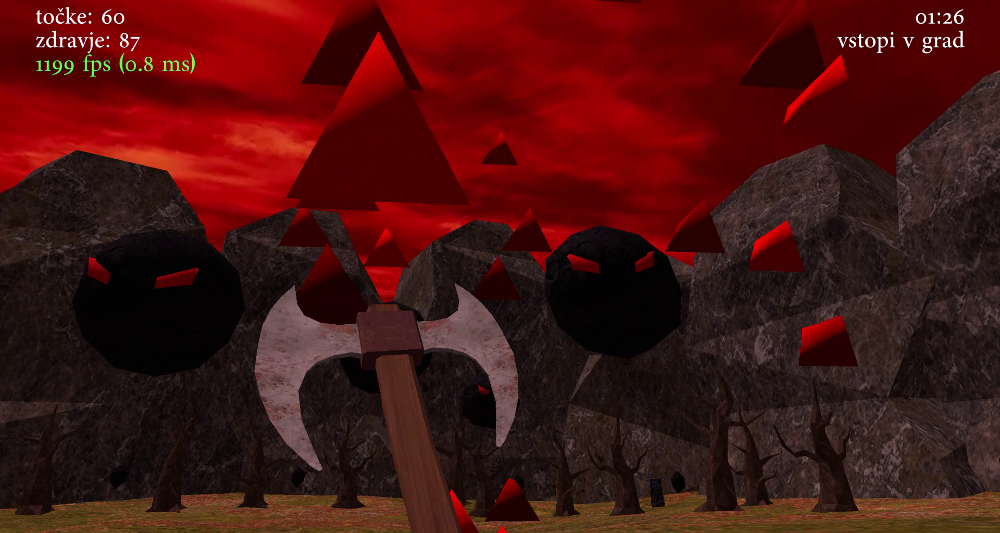

# Kvejken

Za svojo raziskovalno nalogo sem v jeziku C++ napisal računalniško igro Kvejken. V igri je 
igralec za vsako premagano pošast nagrajen s točkami, ki jih lahko potem uporabi za odpiranje 
prehodov in za pridobitev novih orožij. Cilj igre je prebiti se skozi grad in najti lobanjo, ki jo 
potem igralec posadi na prestol. Takrat postane njegov edini cilj preživetje. Za izrisovanje 3D 
objektov sem uporabil programski vmesnik OpenGL, kolizijo pa sem implementiral tako, da 
sem vse trikotnike, iz katerih je sestavljen svet, zbral v drevesno strukturo, da lahko hitreje 
ugotovim, kdaj se igralec česa dotika. Pošasti sledijo igralcu tako, da z žarki preverjajo, kako 
daleč se lahko premaknejo v določeno smer.
